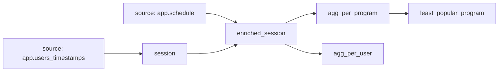

# dbt exercise 6: Select models from a graph

Write commands for this example graph. These models are not files in `dbt_academy`.

1. Run `session` and its descendants. Exclude `agg_per_user`.
2. Select descendants of `session` that are also ancestors of `agg_per_program`.
3. The `app.schedule` source changes. Select all models that depend on it.
4. Run `agg_per_program` and `agg_per_user` daily. Run `least_popular_program` monthly, after the daily run. Define tags and commands.

Use `model+` for descendants and `+model` for ancestors.
A comma intersects selectors. `--exclude` removes models. `tag:daily` selects a tag.
