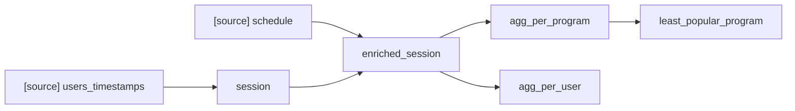

# Exercise 6 — Running specific models

## Goal

Run subsets of your project with `dbt run --select`, using graph operators
(`+`), tags, and `--exclude`.

## Why this matters

`dbt run` executes *everything*. On a real project that is slow and expensive.
Day to day you want: "run only the model I'm working on", "run my model and
everything that depends on it", "run the daily models but not the monthly ones".
Node selection is how schedulers run dbt in production.

## Concepts

```bash
dbt run --select my_model            # one specific model
dbt run --select path/to/models     # all models in a folder
dbt run --select tag:daily          # all models with a tag
```

**Graph operators** select relatives in the DAG:

```bash
dbt run --select my_model+    # my_model and all its children (downstream)
dbt run --select +my_model    # my_model and all its parents (upstream)
dbt run --select +my_model+   # both
dbt run --select source:my_source.my_table+   # everything depending on a source table
```

Typical use: you changed `model_b`, so its downstream models must be rebuilt, but
nothing upstream: `dbt run --select model_b+`.

**Tags** are labels you attach in a model
(`{{ config(tags=['daily']) }}`) or in `dbt_project.yml`, to select groups of
models. **Excluding** works with `--exclude`:

```bash
dbt run --select model_a+ --exclude tag:monthly
```

Selectors can be combined: space = union (OR), comma = intersection (AND):

```bash
dbt run --select marts/finance tag:daily    # in the folder OR tagged daily
dbt run --select marts/finance,tag:daily    # in the folder AND tagged daily
```

## Exercise

This is a pen-and-paper exercise on the following DAG (sources in brackets):



Write the `dbt run` command for each case:

1. Run the model `session` and all models that depend on it, but not the model
   `agg_per_user`.
2. Run the model `session` and all models that depend on it that are also
   ancestors of the model `agg_per_program`.
3. Suppose new data comes in for the `schedule` source table. Run all models
   that depend on it.
4. We want to update `agg_per_program` and `agg_per_user` daily, and
   `least_popular_program` monthly:
   - Which dbt command would you give to a scheduler to execute daily?
   - Which command to execute monthly, after the daily command for that day?
   - Minimize the number of models dbt runs, and make it easy to change which
     models run daily/monthly (tip: use tags).

## Tips

- For question 2, think about combining a `+` selector with an intersection.
- Reference: https://docs.getdbt.com/reference/node-selection/syntax
