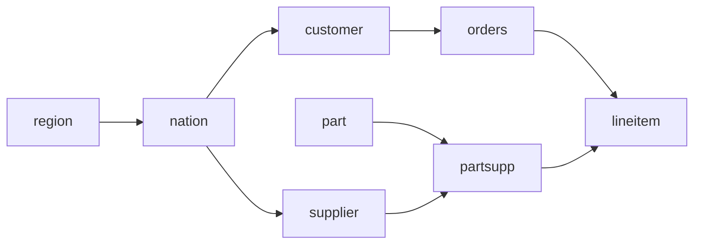

# Part 1 — SQL

SQL (Structured Query Language) is the language used to ask questions to a
database. It is *declarative*: you describe **what** you want, and the database
figures out **how** to get it. Almost every data tool speaks SQL, which is why it
is called the "lingua franca" of data work — and why dbt (part 2) is built
entirely on top of it.

## Running your first query

Inside the codespace you can query the Postgres database in three ways.
The easiest is **SQLTools** (a VSCode extension, already configured):

1. Click the SQLTools icon (a cylinder) in the left sidebar.
2. Connect to the preconfigured Postgres connection.
3. Open a new SQL file, type a query, and run it.

Alternatively, use **pgAdmin** (a web-based database client): open the **Ports**
tab, and click the forwarded URL of port **5052**.

Try this now:

```sql
SELECT * FROM tpch.customer;
```

`SELECT * FROM <table>` returns every column and every row of a table. If you see
a table with 150 customers, you are ready.

## The TPC-H dataset

You'll query a fictional wholesale business. The tables (all in schema `tpch`):

| Table | Contains | Column prefix |
|---|---|---|
| `customer` | customers | `c_` |
| `orders` | orders placed by customers | `o_` |
| `lineitem` | individual lines of each order | `l_` |
| `part` | products | `p_` |
| `supplier` | suppliers of parts | `s_` |
| `partsupp` | which supplier supplies which part | `ps_` |
| `nation` | countries | `n_` |
| `region` | continents | `r_` |

How they relate (arrows point from "one" to "many"):



Every column name carries the prefix of its table: the customer's name is
`c_name`, the order's total price is `o_totalprice`, and so on. Foreign keys
follow the same idea: `orders.o_custkey` points to `customer.c_custkey`.

## Exercises

| # | Topic |
|---|---|
| [01](01_select_and_filter/) | Selecting and filtering rows (`SELECT`, `WHERE`, `DISTINCT`, `LIKE`) |
| [02](02_joins/) | Combining tables (`JOIN`) |
| [03](03_group_by_and_aggregations/) | Summarizing data (`GROUP BY`, `HAVING`) |
| [04](04_ctes/) | Structuring long queries (CTEs) |
| [05](05_window_functions/) | Calculating across rows (window functions) |
