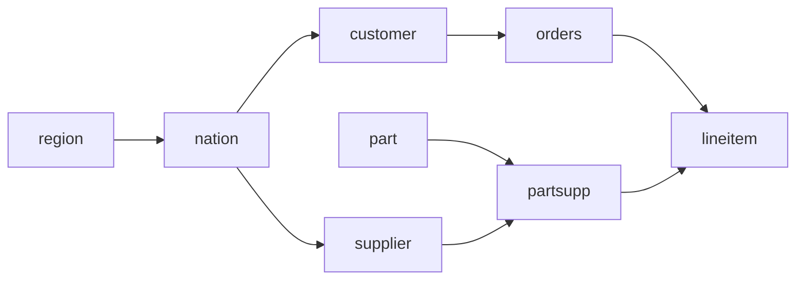

# Part 1 — SQL

SQL (Structured Query Language) is the language used to ask questions to a
database. It is *declarative*: you describe **what** you want, and the database
figures out **how** to get it. Almost every data tool speaks SQL, which is why it
is called the "lingua franca" of data work — and why dbt (part 2) is built
entirely on top of it.

## Running your first query

For Databricks, open the workspace **SQL editor**. Select your SQL warehouse.
Run this at the start of each new query:

```sql
USE CATALOG samples;
USE SCHEMA tpch;
SELECT * FROM tpch.customer LIMIT 10;
```

The exercises use names such as `tpch.customer`.
They work when the current catalog is `samples`.
You can also use the full name: `samples.tpch.customer`.

For the Postgres backup, open **SQLTools** in the codespace.
Connect to the preconfigured Postgres connection. Run this:

```sql
SELECT * FROM tpch.customer LIMIT 10;
```

You can also open pgAdmin from the **Ports** tab on port **5052**.
Postgres has 150 customers. Databricks has a larger sample.

## The TPC-H dataset

You'll query a fictional wholesale business. The tables (all in schema `tpch`):

| Table | Contains | Column prefix |
|---|---|---|
| `customer` | customers | `c_` |
| `orders` | orders placed by customers | `o_` |
| `lineitem` | individual lines of each order | `l_` |
| `part` | products | `p_` |
| `supplier` | suppliers of parts | `s_` |
| `partsupp` | which supplier supplies which part | `ps_` |
| `nation` | countries | `n_` |
| `region` | continents | `r_` |

How they relate (arrows point from "one" to "many"):



Every column name carries the prefix of its table: the customer's name is
`c_name`, the order's total price is `o_totalprice`, and so on. Foreign keys
follow the same idea: `orders.o_custkey` points to `customer.c_custkey`.

## Exercises

| # | Topic |
|---|---|
| [01](01_select_and_filter/) | Selecting and filtering rows (`SELECT`, `WHERE`, `DISTINCT`, `LIKE`) |
| [02](02_joins/) | Combining tables (`JOIN`) |
| [03](03_group_by_and_aggregations/) | Summarizing data (`GROUP BY`, `HAVING`) |
| [04](04_ctes/) | Structuring long queries (CTEs) |
| [05](05_window_functions/) | Calculating across rows (window functions) |
